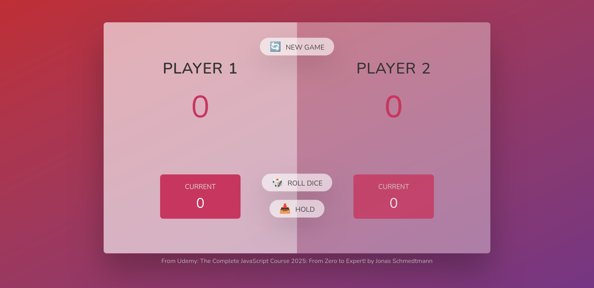

# Udemy: The Complete JavaScript Course 2025: From Zero to Expert! / Section 7: PROJECT #3:Pig Game

## Table of contents

- [Overview](#overview)
  - [Screenshot](#screenshot)
- [My process](#my-process)
  - [Built with](#built-with)

## Overview

This is a project from Udemy's tutorial: The Complete JavaScript Course 2025: From Zero to Expert! by Jonas Schmedtmann. It's a learning process project. Build only for desktop users.

### Screenshot

### Links

- Solution URL: 
- Live Site URL: 

## My process

### Built with

- Tailwind
- Javascript
